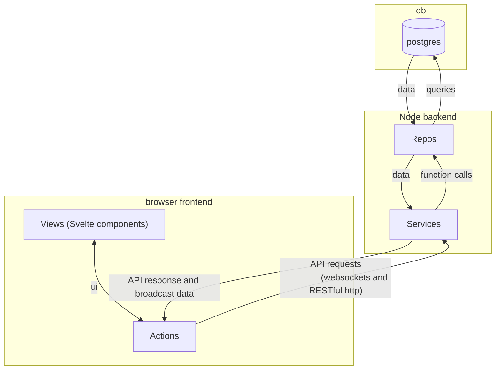

# Contributing to `@getloom/loom`

Thanks for your interest in helping develop Loom!

If you are interested in getting involved in the development process, join our public Loom instance at https://getloom.org

Our public roadmap is available [here!](https://getloom.org/roadmap)

If you're looking to get started with development, check out our [Getting Started docs here](./docs/developers/getting_started.md)

Our code is open source, so we publish it as we write it,
and [the license](LICENSE) is permissive, so you can do whatever you wish with it.
See also our [GOVERNANCE.md](GOVERNANCE.md)
and [CODE_OF_CONDUCT.md](CODE_OF_CONDUCT.md).

Some ways to engage with the project include:
* [opening issues](https://github.com/getloom/loom/issues) on the GitHub project
* joining the development community at [getloom.org](https://getloom.org)
* for private feedback email [hamilton@getloom.org](mailto:hamilton@getloom.org).

[Pull requests](https://github.com/getloom/loom/pulls)
are welcome for straightforward fixes and improvements,
but when there's non-obvious design choices or other ambiguities,
please open an [issue](https://github.com/getloom/loom/issues)
to work out the details with the maintainers.

Loom is currently governed by a
[Temporary Benevolent Dictator (TBD)](GOVERNANCE.md)

## Tech Stack

