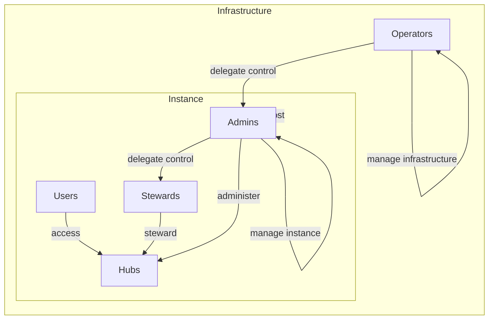

# Admin
When a Loom server instance is first created, it has no communities, no accounts, and no actors.

When the first actor is created, which happens when the first account signs up, the server creates a special hub, the "admin" hub, located at <code>$HOSTNAME/admin</code>, and adds that first actor to its assignments. 

This hub inherits all of the same functionality as normal community hubs, but all of its members are granted superpowers: they are instance admins.

The admin system is orthogonal to the roles systems. Admins are not implemented as roles; roles
		are hub-specific, and admins wield instance-wide powers. If an actor has an assignment to the
		admin hub, they're an admin.

Admins are superusers, which means they have full control over the instance. (it's possible
		we'll develop features to restrict admin powers) Admins access their powers through the normal
		web frontend.

For efficiency and ergonomics, the admin hub and admin actor are both hardcoded to have id <code
			>1</code
		>
		and name `"admin"`:
	</p>

```
const adminHub = {'{'}
	hub_id: 1,
	type: 'community',
	name: 'admin',
};
const adminActor = {'{'}
	actor_id: 1,
	type: 'community',
	name: 'admin',
	hub_id: 1,
};
```


>learn more about <a href="{base}{path}/guide/user/hub-types">hub types</a> and
		<a href="{base}{path}/guide/user/actor-types">actor types</a>

## Deploying a custom home site
Inside your Admin hub there should be a space called `site-admin`. There you can configure the deployable home site to target a publc repo using the [site-template](https://github.com/getloom/site-template.git) to be the target of deployment.

Just enter the URL to your repo & hit `deploy`.

## Control overview diagram
