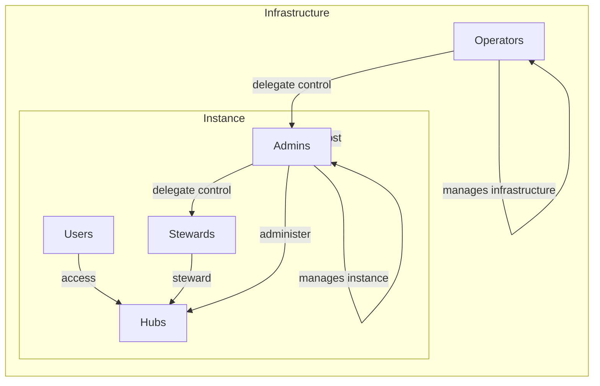

# Admin

When a Felt server instance is first created,
it has no communities, no accounts, and no personas.
When the first persona is created, which happens when the first account signs up,
the server creates a special hub, the "admin" hub, located at `$HOSTNAME/admin`,
and adds that first persona to its assignments.
This hub inherits all of the same functionality as normal community hubs,
but all of its members are granted superpowers: they are instance admins.

The admin system is orthogonal to the roles systems.
Admins are not implemented as roles; roles are hub-specific,
and admins wield instance-wide powers.
If a persona has an assignment to the admin hub, they're an admin.

Admins are superusers, which means they have full control over the instance.
(it's possible we'll develop features to restrict admin powers, but that's speculative)
Admins access their powers through the same web frontend as the rest of the app.

For efficiency and ergonomics, the admin hub and admin persona are both hardcoded
to have id `1` and name `"admin"`:

```ts
const adminHub = {
	hub_id: 1,
	type: 'community',
	name: 'admin',
};
const adminPersona = {
	persona_id: 1,
	type: 'community',
	name: 'admin',
	hub_id: 1,
};
```

> learn more about [hub types](./hub-types.md) and [persona types](./persona-types.md)

## Control and ownership diagram


