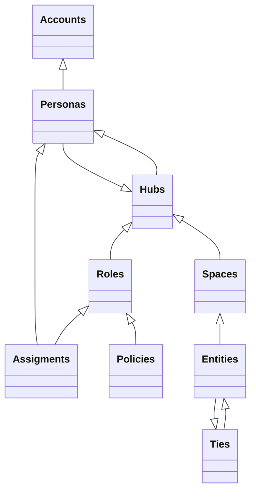

# Data Model

This document provides a layout of Felt's core SQL database tables:

```mermaid
    classDiagram
        Accounts <|-- Personas
        Personas <|-- Hubs
        Hubs <|-- Personas
        Hubs <|-- Roles
        Roles <|-- Assigments
        Personas <|-- Assigments
        Roles <|-- Policies
        Hubs <|-- Spaces
        Spaces <|-- Entities
        Entities <|-- Ties
        Ties <|-- Entities
```
